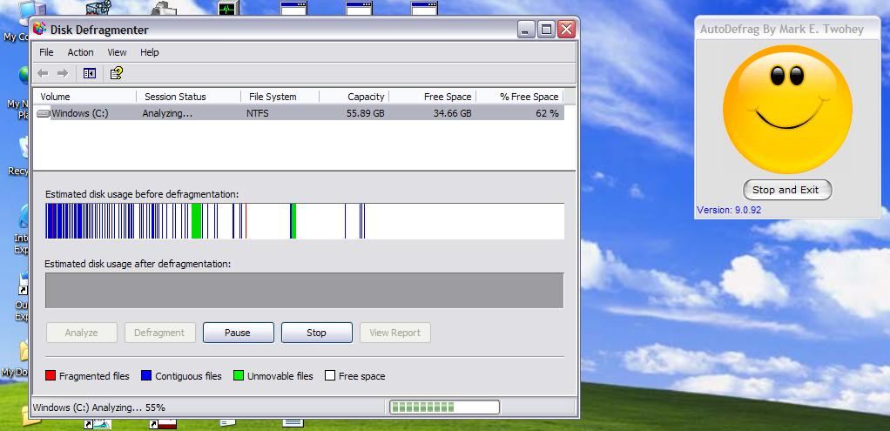



## AutoDefrag

### Description

Make it easier to Schedule Defrag. works on windows 2000 and XP home/pro. Added Screen Saver pause while Defrag is running. Please Vote for me. Thank You
 
### More Info
 
command line support for more then one hard drive.

             |
---                |---
**Submitted On**   |2007-05-28 18:29:54
**By**             |[Mark E\. Twohey](https://github.com/Planet-Source-Code/PSCIndex/blob/master/ByAuthor/mark-e-twohey.md)
**Level**          |Intermediate
**User Rating**    |5.0 (10 globes from 2 users)
**Compatibility**  |VB 6\.0
**Category**       |[Windows System Services](https://github.com/Planet-Source-Code/PSCIndex/blob/master/ByCategory/windows-system-services__1-35.md)
**World**          |[Visual Basic](https://github.com/Planet-Source-Code/PSCIndex/blob/master/ByWorld/visual-basic.md)
**Archive File**   |[AutoDefrag2067995292007\.zip](https://github.com/Planet-Source-Code/mark-e-twohey-autodefrag__1-68616/archive/master.zip)

